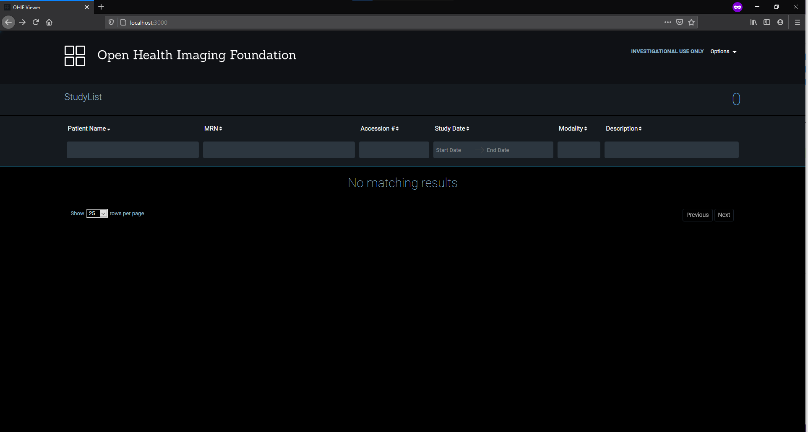
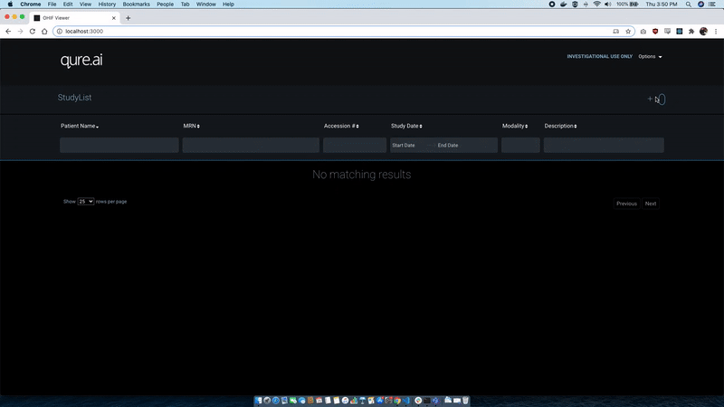

# OHIF docker compose

Docker compose for OHIF dicom viewer. You can deploy a PACS and fully featured dicom viewer in a single line.

## Run OHIF and Orthanc

```
git clone https://github.com/qureai/ohif-docker-compose
cd ohif-docker-compose
docker-compose up -d
```

Open http://localhost:3000 in your browser and you should see this:




## Import Dicom files


```
pip install httplib2
python ImportDicomFiles.py localhost 8042 /path/to/input/dir
```

TODO: run import inside docker

You can also upload Dicom files using OHIF itself.



## Stop the service

```
docker-compose down
```
